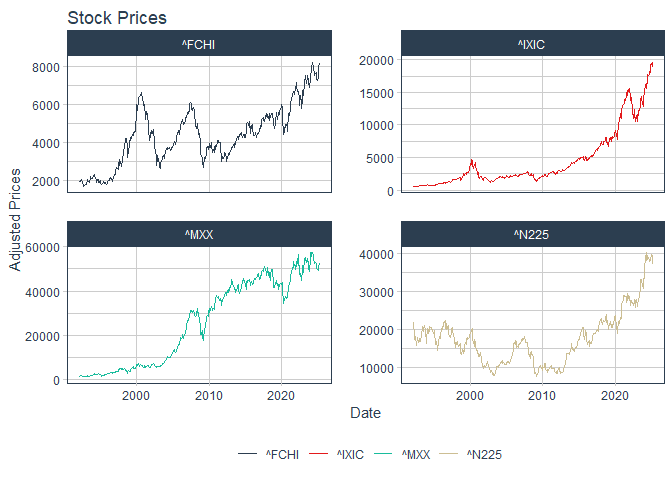

Risques extrêmes et application à la mesure du risque de marché
================
Pierre Clauss
Mars 2025

*Ce document R Markdown a pour objet la résolution des exercices 1.1 et
2.1 du cours.*

## Préambule

Je précise en préambule les 3 étapes nécessaires pour la réussite d’un
projet de data science :

1.  données : (i) importation, (ii) wrangling et (iii) visualisation (ou
    appelée encore *analyse exploratoire des données*)
2.  modélisation
3.  communication des résultats

L’univers du package **tidyverse** est essentiel pour réaliser ces 3
étapes avec R aujourd’hui. Pour comprendre cet univers, je conseille
[**cet
aide-mémoire**](https://thinkr.fr/pdf/dplyr-french-cheatsheet.pdf) en
français et
[**celui-ci**](https://media.datacamp.com/legacy/image/upload/v1676302697/Marketing/Blog/Tidyverse_Cheat_Sheet.pdf)
en anglais en premier lieu, et pour aller plus loin, l’ouvrage de
référence [**R for Data
Science**](https://r4ds.had.co.nz/introduction.html) de Grolemund G. and
Wickham H.

``` r
library(tidyverse)
```

## 1 Données

### 1.1 Importation

J’importe les données de [*Yahoo
Finance*](https://fr.finance.yahoo.com/indices-mondiaux) à l’aide du
package très performant
[**tidyquant**](https://business-science.github.io/tidyquant/). Je
m’intéresse aux indices actions CAC 40, NASDAQ Composite, Nikkei 225 et
IPC Mexico. L’échantillon commence en janvier 1992 et se termine en
février 2025.

``` r
library(tidyquant)
symbols <- c("^FCHI", "^IXIC", "^N225", "^MXX")
stock_prices <- symbols %>%
  tq_get(get  = "stock.prices",
         from = "1992-01-01",
         to   = "2025-03-01") %>%
  group_by(symbol)

(stock_prices %>% slice(1, n()))
```

    ## # A tibble: 8 × 8
    ## # Groups:   symbol [4]
    ##   symbol date         open   high    low  close     volume adjusted
    ##   <chr>  <date>      <dbl>  <dbl>  <dbl>  <dbl>      <dbl>    <dbl>
    ## 1 ^FCHI  1992-01-02  1755.  1766.  1747.  1750.          0    1750.
    ## 2 ^FCHI  2025-02-28  8047.  8112.  8031.  8112.  132221800    8112.
    ## 3 ^IXIC  1992-01-02   580.   586.   576.   586.  181380000     586.
    ## 4 ^IXIC  2025-02-28 18477. 18861. 18373. 18847. 8247520000   18847.
    ## 5 ^MXX   1992-01-02  1445.  1445.  1445.  1445.          0    1445.
    ## 6 ^MXX   2025-02-28 52665. 52893. 52235. 52326.  484856000   52326.
    ## 7 ^N225  1992-01-06 23031. 23802. 23031. 23801.          0   23801.
    ## 8 ^N225  2025-02-28 37853. 37925. 36840. 37156.  191600000   37156.

### 1.2 Démêlage (wrangling en anglais)

“Tidying and transforming are called *wrangling*, because getting your
data in a form that’s natural to work with often feels like a fight”,
[**R for Data Science**](https://r4ds.had.co.nz/introduction.html)
(Grolemund G. and Wickham H.).

Ici, je **transforme** les données de prix en rentabilités sous forme de
vecteur mais aussi (cela va m’être utile par la suite) de matrice.

``` r
daily_returns <- stock_prices %>%
  group_by(symbol) %>%
  tq_transmute(
    select     = adjusted,
    mutate_fun = periodReturn,
    period     = "daily",
    type       = "arithmetic",
    col_rename = "dreturns"
  )

(daily_returns %>% slice(1, n()))
```

    ## # A tibble: 8 × 3
    ## # Groups:   symbol [4]
    ##   symbol date       dreturns
    ##   <chr>  <date>        <dbl>
    ## 1 ^FCHI  1992-01-02  0      
    ## 2 ^FCHI  2025-02-28  0.00112
    ## 3 ^IXIC  1992-01-02  0      
    ## 4 ^IXIC  2025-02-28  0.0163 
    ## 5 ^MXX   1992-01-02  0      
    ## 6 ^MXX   2025-02-28 -0.00536
    ## 7 ^N225  1992-01-06  0      
    ## 8 ^N225  2025-02-28 -0.0288

``` r
table_returns <-
  daily_returns %>%
  pivot_wider(names_from = symbol, values_from = dreturns) %>%
  select(-"date")

(table_returns)
```

    ## # A tibble: 8,627 × 4
    ##     `^FCHI`  `^IXIC`  `^N225`    `^MXX`
    ##       <dbl>    <dbl>    <dbl>     <dbl>
    ##  1  0        0       NA        0       
    ##  2  0.0117   0.0106  NA        0.0210  
    ##  3  0.00977  0.00886  0       -0.00183 
    ##  4 -0.00498  0.00734 -0.00986  0.00876 
    ##  5  0.00388  0.0133  -0.0361   0.0204  
    ##  6  0.0270   0.0155   0.0175   0.00917 
    ##  7  0.00191 -0.00661 -0.0317  -0.00314 
    ##  8 -0.00713  0.00313 -0.0306   0.00669 
    ##  9  0.0107   0.0131   0.00361  0.0191  
    ## 10  0.0162   0.00810 NA        0.000703
    ## # ℹ 8,617 more rows

Il y a quelques données manquantes que je devrai gérer dans la partie
modélisation.

### 1.3 Visualisation

Une première visualisation se fait sur les prix des indices avant
d’observer les rentabilités et les statistiques descriptives sur ces
rentabilités.

Je choisis de construire les graphiques sur les prix mensuels pour avoir
un lissage des graphiques relativement aux prix quotidiens.

``` r
monthly_prices <- stock_prices %>%
  group_by(symbol) %>%
  tq_transmute(select = adjusted,
               mutate_fun = to.monthly,
               indexAt = "lastof")

monthly_prices %>%
  ggplot(aes(x = date, y = adjusted, color = symbol)) +
  geom_line(size = 0.25) +
  labs(
    title = "Stock Prices",
    x = "Date",
    y = "Adjusted Prices",
    color = ""
  ) +
  facet_wrap(~ symbol, ncol = 2, scales = "free_y") +
  theme_tq() +
  scale_color_tq()
```

<!-- -->

Les statistiques de base sur les rentabilités sont résumées par le
tableau et les graphiques ci-dessous. Nous pouvons observer un fait
stylisé très important des rentabilités d’indices de marché, à savoir la
leptokurticité de leur densité.

``` r
daily_returns %>%
  group_by(symbol) %>%
  summarise(moyenne = mean(dreturns),
            ecartype = sd(dreturns),
            nombre = n(),
            min = min(dreturns),
            max = max(dreturns)
  )
```

    ## # A tibble: 4 × 6
    ##   symbol  moyenne ecartype nombre    min   max
    ##   <chr>     <dbl>    <dbl>  <int>  <dbl> <dbl>
    ## 1 ^FCHI  0.000272   0.0134   8432 -0.123 0.112
    ## 2 ^IXIC  0.000525   0.0148   8350 -0.123 0.142
    ## 3 ^MXX   0.000529   0.0140   8311 -0.133 0.129
    ## 4 ^N225  0.000161   0.0146   8137 -0.124 0.142

``` r
daily_returns %>%
  ggplot(aes(x = date, y = dreturns, color = symbol)) +
  geom_line(size = 0.25) +
  labs(
    title = "Stock",
    x = "Date",
    y = "Daily Returns",
    color = ""
  ) +
  facet_wrap( ~ symbol, ncol = 2, scales = "free_y") +
  theme_tq() +
  scale_color_tq()
```

<!-- -->

``` r
daily_returns %>%
  ggplot(aes(x = dreturns, fill = symbol)) +
  geom_density(alpha = 0.5) +
  labs(title = "Densités des rentabilités arithmétiques",
       x = "Rentabilités quotidiennes", y = "Densité") +
  theme_tq() +
  scale_fill_tq() +
  facet_wrap(~ symbol, ncol = 2)
```

<!-- -->

``` r
daily_returns %>%
  ggplot(aes(sample = dreturns, colour = factor(symbol))) +
  stat_qq() +
  stat_qq_line() +
  theme_tq() +
  scale_fill_tq() +
  facet_wrap(~ symbol, ncol = 2)
```

<!-- -->

## 2 Modélisation

Les VaR sont soit non-paramétriques (historique et bootstrap) soit
paramétriques (Gaussienne, Skew Student, GEV et GPD).

### 2.1 Résolution de *l’exercice 1.1* du cours

Ci-dessous, je vous propose un premier tuto pour calculer la VaR
Historique du CAC 40 :

``` r
cac40 <- as.matrix(na.omit(table_returns[,1]))
quantile(cac40, probs = c(0.01, 0.001))
```

    ##          1%        0.1% 
    ## -0.03889628 -0.06348220

``` r
# VaR Historique et Gaussienne - Option 1
daily_returns %>%
  group_by(symbol) %>%
  summarise(Histo = quantile(dreturns, c(0.01, 0.001)),
            Gauss = mean(dreturns) + sd(dreturns) * qnorm(c(0.01, 0.001), 0, 1))
```

    ## # A tibble: 8 × 3
    ## # Groups:   symbol [4]
    ##   symbol   Histo   Gauss
    ##   <chr>    <dbl>   <dbl>
    ## 1 ^FCHI  -0.0389 -0.0310
    ## 2 ^FCHI  -0.0635 -0.0412
    ## 3 ^IXIC  -0.0409 -0.0338
    ## 4 ^IXIC  -0.0727 -0.0451
    ## 5 ^MXX   -0.0386 -0.0319
    ## 6 ^MXX   -0.0642 -0.0426
    ## 7 ^N225  -0.0387 -0.0338
    ## 8 ^N225  -0.0697 -0.0449

``` r
# VaR Historique et Gaussienne - Option 2
# pour le CAC 40
cac40 <- as.matrix(na.omit(table_returns[,1]))
quantile(cac40, probs = c(0.01, 0.001))
```

    ##          1%        0.1% 
    ## -0.03889628 -0.06348220

``` r
mean(cac40) + sd(cac40) * qnorm(c(0.01, 0.001), 0, 1)
```

    ## [1] -0.03097847 -0.04124001

``` r
# pour les 4 indices en même temps
table_returns %>%
  apply(2, quantile, probs = c(0.01, 0.001), na.rm = T)
```

    ##            ^FCHI       ^IXIC       ^N225        ^MXX
    ## 1%   -0.03889628 -0.04087720 -0.03868523 -0.03855831
    ## 0.1% -0.06348220 -0.07267953 -0.06966739 -0.06415691

``` r
table_returns %>%
  apply(2, function(x) mean(x, na.rm = T) + sd(x, na.rm = T) * qnorm(c(0.01, 0.001), 0, 1))
```

    ##            ^FCHI       ^IXIC       ^N225        ^MXX
    ## [1,] -0.03097847 -0.03384652 -0.03376006 -0.03192393
    ## [2,] -0.04124001 -0.04513278 -0.04489852 -0.04258029

``` r
# Estimation de la VaR skew Student pour le CAC 40 - option 1
library(sn)
esti <- daily_returns %>%
  filter(symbol == '^FCHI') %>%
  reframe(st.mple(y = dreturns)$dp)
qst(c(0.01, 0.001), esti[[1, 2]], esti[[2, 2]], esti[[3, 2]], esti[[4, 2]])
```

    ## [1] -0.04338298 -0.10551925

``` r
# Estimation de la VaR skew Student pour le CAC 40 - option 2
esti <- st.mple(y = cac40)
qst(c(0.01, 0.001), esti$dp["xi"], esti$dp["omega"], esti$dp["alpha"], esti$dp["nu"])
```

    ## [1] -0.04338298 -0.10551925

``` r
library(scales)
library(sn)

VaR_classiques <- function(data, alpha)
{
  #VaR Historique
  Hist <- quantile(data, probs = alpha)
  Hist <- percent(Hist, 0.01)
  
  # VaR Gaussienne
  Gauss <- mean(data) + sd(data) * qnorm(alpha, 0, 1)
  Gauss <- percent(Gauss, 0.01)
  
  # VaR skew Student
  esti <- st.mple(y = data)
  Skt <- qst(alpha, esti$dp["xi"], esti$dp["omega"], esti$dp["alpha"], esti$dp["nu"])
  Skt <- percent(Skt, 0.01)
  
  tibble(
    Historique = Hist,
    Gaussienne = Gauss,
    Skew_Student = Skt
  )
}
```

Voici ci-dessous les VaR demandées dans *l’exercice 1.1* pour les
différents indices avec alpha = 1%.

``` r
library(pander)
VaR_1 <- daily_returns %>%
  group_by(symbol) %>%
  reframe(VaR_classiques(dreturns, alpha = 0.01))
pander(VaR_1)
```

| symbol | Historique | Gaussienne | Skew_Student |
|:------:|:----------:|:----------:|:------------:|
| ^FCHI  |   -3.89%   |   -3.10%   |    -4.34%    |
| ^IXIC  |   -4.09%   |   -3.38%   |    -7.29%    |
|  ^MXX  |   -3.86%   |   -3.19%   |    -4.00%    |
| ^N225  |   -3.87%   |   -3.38%   |    -5.43%    |

Voici ci-dessous les VaR demandées dans *l’exercice 1.1* pour les
différents indices avec alpha = 0.1%.

| symbol | Historique | Gaussienne | Skew_Student |
|:------:|:----------:|:----------:|:------------:|
| ^FCHI  |   -6.35%   |   -4.12%   |   -10.55%    |
| ^IXIC  |   -7.27%   |   -4.51%   |   -28.53%    |
|  ^MXX  |   -6.42%   |   -4.26%   |    -9.24%    |
| ^N225  |   -6.97%   |   -4.49%   |   -14.82%    |

### 2.2 Résolution de *l’exercice 2.1* du cours

Pour définir la VaR GPD, il est nécessaire de déterminer le seuil à
partir duquel il est raisonnable de penser que les extrêmes suivent une
loi GPD. Cela se fait grâce au mean-excess plot : le seuil optimal est
la valeur à partir de laquelle la tendance est croissante.

``` r
library(evir)

layout(matrix(1:4,2,2))

invisible(daily_returns %>%
            filter(symbol == '^FCHI') %>%
            reframe(meplot(-dreturns[dreturns < 0])))

invisible(daily_returns %>%
            filter(symbol == '^IXIC') %>%
            reframe(meplot(-dreturns[dreturns < 0])))

invisible(daily_returns %>%
            filter(symbol == '^N225') %>%
            reframe(meplot(-dreturns[dreturns < 0])))

invisible(daily_returns %>%
            filter(symbol == '^MXX') %>%
            reframe(meplot(-dreturns[dreturns < 0])))
```

<!-- -->

``` r
VaR_TVE <- function(data,
                    alpha,
                    bloc = 21,
                    seuil = 0.01)
{
  # VaR GEV
  g1 <- gev(-data, bloc)
  alphaGEV <- 1 - bloc * alpha
  GEV <-
    -qgev(alphaGEV, g1$par.ests["xi"], g1$par.ests["mu"], g1$par.ests["sigma"])
  GEV <- percent(GEV, 0.01)
  
  # VaR GPD
  g2 <- gpd(-data, seuil)
  p <- length(g2$data) / length(data)
  GPD <- -qgpd(1 - alpha / p, g2$par.ests["xi"], seuil, g2$par.ests["beta"])
  GPD <- percent(GPD, 0.01)
  
  tibble(
    GEV = GEV, 
    GPD = GPD)
}
```

Voici ci-dessous les VaR TVE demandées dans *l’exercice 2.1* pour les
différents indices avec alpha = 1%.

``` r
VaR_1 <- daily_returns %>%
  group_by(symbol) %>%
  reframe(VaR_TVE(dreturns, alpha = 0.01, seuil = 0.03))
pander(VaR_1)
```

| symbol |  GEV   |  GPD   |
|:------:|:------:|:------:|
| ^FCHI  | -3.06% | -3.80% |
| ^IXIC  | -3.23% | -4.12% |
|  ^MXX  | -3.06% | -3.84% |
| ^N225  | -3.40% | -3.87% |

Voici ci-dessous les VaR TVE demandées dans *l’exercice 2.1* pour les
différents indices avec alpha = 0.1%.

``` r
VaR_01 <- daily_returns %>%
  group_by(symbol) %>%
  reframe(VaR_TVE(dreturns, alpha = 0.001, seuil = 0.03))
pander(VaR_01)
```

| symbol |  GEV   |  GPD   |
|:------:|:------:|:------:|
| ^FCHI  | -6.01% | -6.61% |
| ^IXIC  | -6.90% | -7.37% |
|  ^MXX  | -6.70% | -6.89% |
| ^N225  | -6.55% | -7.40% |
